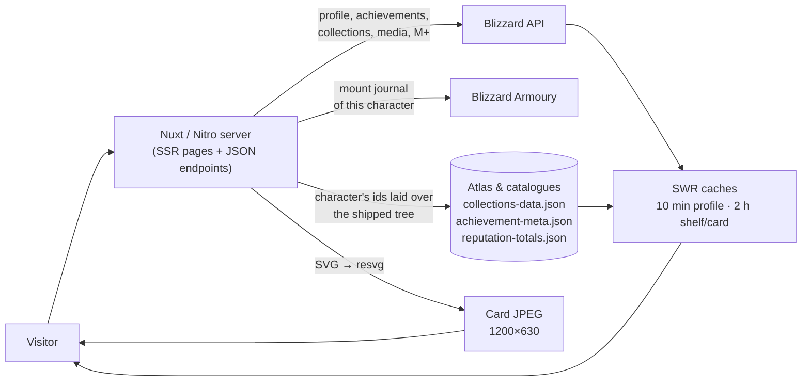

<div align="center">


# ⚔️ Hero of Azeroth

**Everything a World of Warcraft character is — on one page, and in one image.**

Item level · M+ score · achievements · mounts · pets · toys · decor · reputations

[](https://nuxt.com)
[](https://nodejs.org)
[](https://develop.battle.net)
[](#-bilingual)
[](#-disclaimer)

[🌐 heroofazeroth.com](https://heroofazeroth.com) · 🇬🇧 English · 🇷🇺 Русский · 🌍 EU & US realms

<a href="https://heroofazeroth.com"></a>

</div>

---

## ✨ What it does

- 🎴 **Character cards** — a profile rendered as a 1200×630 image. Every page carries its own card as
  its link preview, and the header hands you the file to download or the link to copy.
- 🔎 **Look up anyone** — EU and US realms, realm autocomplete, a search history that remembers what
  you looked at, and addresses that are stable enough to share.
- 🏅 **Overview tab** — item level, M+ score, achievement points against what is reachable, mounts,
  pets, toys, decor and reputations, each tile marked `account-wide` or `per character`.
- 🐎 **Collection shelves** — mounts, pets, toys and decor drawn against the **whole game**: every
  expansion and event bucket with its own bar, every source ("Raid Drop", "Vendor", a zone) as a block
  of tiles beside its neighbours, and a rail of anchors to jump between them.
- 🧭 **Numbers that mean something** — a shelf counts what the character can *still get*
  (SimpleArmory's own numbers), and two switches uncover what it cannot: the retired items and the ones
  the game has not shipped yet. A short note under the bar says where every number comes from.
- 📜 **Activity feed** — the hundred achievements a character earned most recently, with icons and
  filters for all / achievements / PvE / collections / PvP.
- 🏆 **Achievements & reputations** — the account-wide Exalted counter the game's own pane shows, plus
  the ladders this character has finished on its own.
- 🌍 **Bilingual** — English at the plain address, Russian under `/ru`: pages, SEO alternates, the
  card image, and the collection headings themselves.
- ⚡ **Built to be fast** — Blizzard is read once per character and answered from a stale-while-
  revalidate cache; the game's whole catalogue (collections tree, achievement wording, faction
  ladders) is paid for offline and shipped with the build.
- 🎨 **A look of its own** — dark fantasy theme, the character's own Armoury artwork, Wowhead tooltips
  on hover, mobile-first layout.

---

## 🖼 A real card — live, not a screenshot

<div align="center">

<a href="https://heroofazeroth.com/ru/region-eu/gordunni/%D0%BD%D0%B5%D0%B9%D1%80%D0%BE%D0%BC%D0%B0%D1%81%D0%BA">

</a>

<sub>The picture above is drawn on demand by <code>/api/card/…</code> and served as a JPEG — 1200×630,
the size a social network wants, with the character's own render and class artwork in it.</sub>

</div>

### The pages behind it

| Address | What it shows |
| --- | --- |
| `/` | Front door: region switch, realm autocomplete, character name, recent searches |
| `/region-eu/<realm>/<name>` | Overview: the stat tiles, the render, download / share / refresh |
| `/region-eu/<realm>/<name>/collections/mounts` | A shelf: sections with bars, sources side by side, the two switches, the note |
| `/region-eu/<realm>/<name>/activity` | The achievement feed with its category filters |
| `/ru/…` | The very same pages in Russian |

## 🚀 Quick start

```bash
npm install
```

Create a `.env` with a Blizzard API client
([Creator portal](https://develop.battle.net/access/clients) → client credentials):

```bash
NUXT_BLIZZARD_CLIENT_ID=...
NUXT_BLIZZARD_CLIENT_SECRET=...
```

Then:

```bash
npm run dev       # development server on http://localhost:3100
npm run build     # production build into .output
npm run preview   # run the built server locally
npm run deploy    # build, push the sources, upload the build to the host (see Deploying)
```

---

## 🧩 How it works

A page is rendered on the server, so the first response already carries the data — no spinner before
the content. Three kinds of things meet in the process:

- **Live reads.** A character's profile, achievements, collection lists, media and M+ score come from
  Blizzard's profile API, once per character, and the next visitor is answered from a
  stale-while-revalidate cache (ten minutes for a profile, two hours for a shelf or a card) — a burst
  of traffic pays for one lookup.
- **Shipped catalogues.** Everything the game *contains* is paid for offline and compiled into the
  build: the collections atlas, the achievement catalogue, the faction ladders and the total
  fallbacks. None of it is read per request.
- **The card.** `/api/card/…` composes the very icons the page draws into an SVG and rasterises it
  with resvg into a JPEG. That file is what a link preview shows.



### Endpoints

| Endpoint | Answers |
| --- | --- |
| `/api/character/<region>/<realm>/<name>` | The entire profile the overview draws (`?force=true` re-reads Blizzard) |
| `/api/collections/<region>/<realm>/<name>?kind=mounts` | One shelf, laid over the character's ids — `kind` is `mounts`, `pets`, `toys` or `decors`, and `?unobtainable=1` / `?upcoming=1` are the two switches |
| `/api/activity/<region>/<realm>/<name>` | The recent-achievement feed |
| `/api/card/<region>/<realm>/<name>?locale=ru_RU` | The shareable JPEG, 1200×630 |
| `/api/realms` | The realm list the search box completes from |
| `/sitemap.xml` | Every character the site has rendered, with its language alternates |

## 🗂 Project map

| Where | What lives there |
| --- | --- |
| `app/pages/index.vue` | The front door and its search |
| `app/pages/[region]/[realm]/[name].vue` | The character shell: header, tabs, share / download, refresh |
| `app/pages/[region]/[realm]/[name]/` | The tabs themselves: `index` (overview), `collections/*`, `activity` |
| `app/components/` | `CollectionsGrid`, `CollectionShelf`, `CollectionMenu`, `ActivityFeed`, `CharacterName`, `WowheadLink`, `AppIcon`, `SupportButton` |
| `app/composables/` | `characterView`, `collections`, `collectionView` (the two switches), `lang`, `seo`, `searchHistory`, `urls`, `relativeTime`, `wowheadPower` |
| `server/api/` | The endpoints above |
| `server/utils/` | Blizzard client, the atlas and its readers, the card renderer, the SWR cache, reputations, achievements, the Armoury reader |
| `scripts/` | The offline refreshes (see below) and `deploy.mjs` |
| `shared/data/collectionsSchema.ts` | The collection types, the section shape, and the Russian label map |

---

## 🎯 Collections: where the numbers come from

Every mount, pet, toy and decoration in the game, in SimpleArmory's own tree: a bucket per expansion or
event, the sources under it ("Raid Drop", "Vendor", a zone), the items under those. The server lays the
character's own ids over that tree, so a shelf looks the same for everybody and the counts belong to
the character.

Two rules make a shelf read **lower** than the counter in the game — and truer for it:

- 🚫 **Retired items are hidden.** An item the game has done away with is drawn only for a character
  who already holds it: a rarity to show off rather than a goal to chase. It is left out of the count
  too, which is what keeps a 1,300-item shelf from reading 1,404.
- ⏳ **Unreleased items wait.** The Trading Post's coming stock and the mounts of a patch that is not
  live are not drawn at all.

Both are SimpleArmory's own settings, and both are yours as well — the two switches under the shelf's
bar, with a three-line note beside them that says the same:

| Switch | What it uncovers |
| --- | --- |
| **Unobtainable** | Every retired item the site knows, drawn as a grey tile. Items that were never released stay hidden, exactly as they do there |
| **Upcoming** | The handful of items Blizzard has in the files but has not shipped |

With a switch on, a shelf reads exactly what SimpleArmory reads with its own setting on — the numbers
were matched item by item, not approximated.

### Why they differ from the game's own counter

They are meant to: the sources count different sets, and every one of them is right.

| Source | Reads | What it counts |
| --- | --- | --- |
| **In game · Wowhead tracker** | `1215 / 1334` | Everything the character has learned, over the journal the client shows for its faction |
| **Blizzard Armoury** | `1215 / 1387` | The same list, over the Armoury's own journal size — a number that belongs to the character and moves with the patch |
| **Blizzard API** | `1215` learned · `1117` usable | The raw list, ~98 of them unusable mounts of the other faction |
| **Hero of Azeroth — a shelf** | `1163 / 1302` | What this character can still get: SimpleArmory's numbers, to the item |
| **dataforazeroth** | `1162 / 1303` | Their own list, keyed by id rather than by row |

*(one Alliance character, patch 12.1.0 — the absolute numbers move with every patch, the reasons do not)*

The stubborn ±1 against other sites is data, not arithmetic: SimpleArmory counts the **rows** of its own
file, and one mount in it (`Deathtusk Felboar`) sits twice under the same source — a character who owns
it reads one higher there than on any site that keys by id. This project reproduces its rows, because
the tree is its tree.

---

## 🔄 Keeping the data current

Everything a character *is* — collections, achievements, item level, reputations, the artwork — is read
live per request, and those caches expire on their own (a shelf in two hours, a profile in ten minutes,
the Armoury journal a mounts tile is measured against in a day). What a patch moves are the numbers the
site pays for once and ships with the build. One command runs all of them, in the order they are read:

```bash
npm run refresh:all                     # every step, read with the character it remembers
npm run refresh:all eu gordunni name    # the same, read with another character
npm run refresh:all --only=collections,reputations
npm run refresh:all -- --dry-run        # print the commands and run nothing
npm run deploy                          # nothing is live until this runs
```

| Step | Writes | What goes stale without it |
| --- | --- | --- |
| `collections` | `server/utils/collections-data.json` | an item a patch added, a new expansion's bucket, a new source — a shelf keeps the tree of the last run |
| `armoury` | `server/utils/armoury-totals.json` | the two fallbacks (a mount tile is normally measured against the live Armoury journal of that character) |
| `meta` | `server/utils/achievement-meta.json` | the feed cards' wording, points and icons — a new achievement is read live, so it is slower rather than wrong |
| `points` | `server/utils/achievement-points.json` | the fallback total for achievement points |
| `reputations` | `server/utils/reputation-totals.json` | how many factions each side can work on, and the top of every ladder |

The three walks (`meta`, `points`, `reputations`) run with `--fresh`, which drops the progress cache each
of them keeps in the OS temp directory and re-reads every achievement and faction: minutes rather than
seconds, which is what a patch wants.

A heading a patch introduces reads in English until it is named in `SIMPLEARMORY_LABELS_RU`
(`shared/data/collectionsSchema.ts`) — the one regular hand edit, and the run prints the headings that
map has not got yet:

```text
  ⚠ not in the Russian label map yet (they read in English): Midnight: Season 2
```

## 🌍 Bilingual

An address carries its language and its region: `/region-eu/gordunni/<name>` is English, the same page
under `/ru` is Russian, and the front door stays on `/`. Only the non-default language spells itself
out, so links stay short — i18n runs in `no_prefix` mode, the pages read the language off the address
and `app/middleware/lang.global.ts` applies it. Headings that come from SimpleArmory are translated by a
label map rather than by message keys: a new expansion costs one line there, not a key in every locale
file.

Every page carries the same pair of plates in its header (`app/components/LocaleSwitch.vue`): a link to
the same page one segment away, with the language being read warmed in the brand gold. It is a link
rather than a router push because the two addresses are one route — a navigation to the route the
browser is already on is dropped as a duplicate - so the pair reads for a crawler too, and the header
switches with no JavaScript at all.

## 🔎 SEO & sharing

- `NUXT_PUBLIC_SITE_URL` is what canonical links, `og:url`, the hreflang alternates, the JSON-LD nodes
  and `sitemap.xml` are built on, so a staging copy never advertises the production host —
  `public/robots.txt` names the same host literally, so the two are changed together.
- Every character page is `og:image`d with its own card (`summary_large_image`), and `/api/card/` is
  deliberately left crawlable in `robots.txt`: a blocked preview path would leave every shared link
  blank.
- `/sitemap.xml` lists the characters the site has actually rendered (kept in `server/data/`, capped at
  50,000 URLs) with `xhtml:link` alternates per language. A browser opening it gets the page the map
  doubles as (`public/sitemap.xsl`): who has been looked up and what they were — level, class, item
  level, rating — plus the breakdowns worth reading (level, class, realm, the last two weeks, the
  biggest collections), every figure counted off the map itself, so the page and the file a crawler
  reads can never disagree.
- Google Tag Manager is wired in `nuxt.config.ts` — the loader in `<head>`, the `<noscript>` frame right
  after `<body>`.

## ⚙️ Configuration

| Variable | Default | What it does |
| --- | --- | --- |
| `NUXT_BLIZZARD_CLIENT_ID` | — *(required)* | Blizzard API client id |
| `NUXT_BLIZZARD_CLIENT_SECRET` | — *(required)* | Blizzard API client secret |
| `NUXT_PUBLIC_SITE_URL` | `https://heroofazeroth.com` | Canonical host for SEO and the sitemap |
| `NUXT_PUBLIC_GTM_ID` | `GTM-WXMVB755` | Tag manager container |
| `PORT` / `NITRO_PORT` | `3100` | Port the built server binds (`server/plugins/port.ts`) |
| `HOST` | — | Address the built server binds |
| `FTP_*` | — | Deploy target — see below |

The built server listens on `PORT`, else `NITRO_PORT`, else **3100**: Nitro's own fallback is 3000, which
the second application on that host already owns. `nuxt dev` uses the same number.

---

## 📦 Deploying

```bash
npm run deploy
```

1. `nuxt build` writes `.output`, the Nitro `node-server` preset.
2. The sources are committed and pushed to the current branch, `main`. GitHub holds the project only —
   `.output` is ignored by git and never committed.
3. The contents of `.output` are uploaded over FTP to `FTP_PATH`, together with a `deploy.json` that
   records which source commit they were built from.

The build output of a Nuxt server app cannot be served by GitHub Pages: the pages are server-rendered,
and `/api/card`, `/api/character` and `/api/realms` are real endpoints that call the Blizzard API with
your client secret. A Node process has to run the build — hence the FTP upload.

### FTP settings

The upload reads these from the environment, falling back to the gitignored `.env`:

```bash
FTP_SERVER=www.example.com
FTP_USERNAME=...
FTP_PASSWORD=...
FTP_PATH=/data02/virt32423/domeenid/www.example.com/heroofazeroth/
# FTP_PORT=21        # optional, 21 by default
FTP_SECURE=explicit  # FTPS on port 21 (false, explicit or implicit)
FTP_INSECURE=true    # waive the certificate check when the host's certificate
                     # is issued for another name (shared hosting, usually)
# FTP_TLS_MAX=1.2    # highest TLS version for FTPS (1.2, because 1.3 data
                     # connections tend to be aborted by these hosts)
```

`FTP_PATH` is the directory the server runs from, and it receives the *contents* of `.output`:
`server/`, `public/` and `nitro.json` land directly inside it. The transfers are plain `curl` calls
(Windows 10+ ships curl, and it speaks FTP and FTPS); the password travels in a throwaway netrc file, so
it never appears on a command line or in the process list.

### Running what was uploaded

The uploaded directory is the application — no `npm install`, no build tools. `.output` carries its own
`node_modules`, including both the linux-x64 and the win32-x64 resvg binaries:

```bash
cd /data02/virt32423/domeenid/www.example.com/heroofazeroth

NUXT_BLIZZARD_CLIENT_ID=... \
NUXT_BLIZZARD_CLIENT_SECRET=... \
node server/index.mjs
```

The variables are read per request (`useRuntimeConfig()`), so changing them needs a restart, not a
rebuild — and shipping a new version is another `npm run deploy`.

### Deploy options

```bash
npm run deploy                     # build, GitHub, FTP
npm run deploy -- --dry-run        # report what would happen, change nothing
npm run deploy -- --no-build       # upload the `.output` that already exists
npm run deploy -- --no-github      # sources stay local
npm run deploy -- --no-ftp         # sources only
npm run deploy -- --prune          # also delete remote files this build no longer has
npm run deploy -- --verify         # read every directory back and report missing files
npm run deploy -- -m "Fix the card"
```

`npm run deploy:ftp` uploads without building and without touching GitHub; `npm run deploy:github`
pushes the sources only.

`--verify` reads the upload back: every file has to be present, at the size it was built with (one
request per file, so it is the slow part of a deploy). Transfers are retried a few times as well,
because FTP hosts throttle a burst of uploads and answer 451 for a while.

`--prune` never deletes directories, and only deletes files inside `public/` and `server/chunks/` — the
content-hashed bundles that change on every build — so a mistyped `FTP_PATH` cannot wipe anything else.

---

## ☕ Support

The site is free, has no ads and runs out of pocket. If it saved you a look-up,
[](https://buymeacoffee.com/neuromask)
is what keeps it that way.

## ⚖️ Disclaimer

An unofficial fan project. World of Warcraft, its names, items, icons and artwork belong to Blizzard
Entertainment; the numbers come from Blizzard's public API and Armoury, and the collection tree from
[SimpleArmory](https://simplearmory.com)'s own published files; tooltips and sprites come from
Wowhead/ZamImg. Nothing here is endorsed by any of them. The repository ships no licence file yet, so
all rights are reserved by default — ask first if you want to reuse the code.

<div align="center">

<sub>Made for collectors, by a collector · <a href="https://heroofazeroth.com">heroofazeroth.com</a></sub>

</div>


